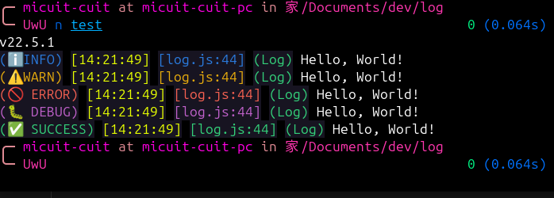
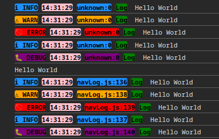

# mi-log
mi-log is a simple logger for nodejs and browser.

## use in nodejs
```javascript
    const Log = require('mi-log');
    const log = new Log([
        { style: 'circle', color: 'brightGreen', text: 'Log' }
    ])//optional
    log.l('Hello, World!');
    log.w('Hello, World!');
    log.e('Hello, World!');
    log.d('Hello, World!');
    log.s('Hello, World!');
```

## use in browser
```html
    <script src="mi-navlog.js"></script>
    <script>
        const navLog = new Log([{ style: 'circle', color: 'green', text: 'Log' }]);//optional
        navLog.l('Hello World');
        navLog.w('Hello World');
        navLog.e('Hello World');
        navLog.i('Hello World');
        navLog.d('Hello World');
        navLog.c('Hello World');
        navLog.show.l('Hello World');
        navLog.show.w('Hello World');
        navLog.show.e('Hello World');
        navLog.show.i('Hello World');
        navLog.show.d('Hello World');
    </script>
```
